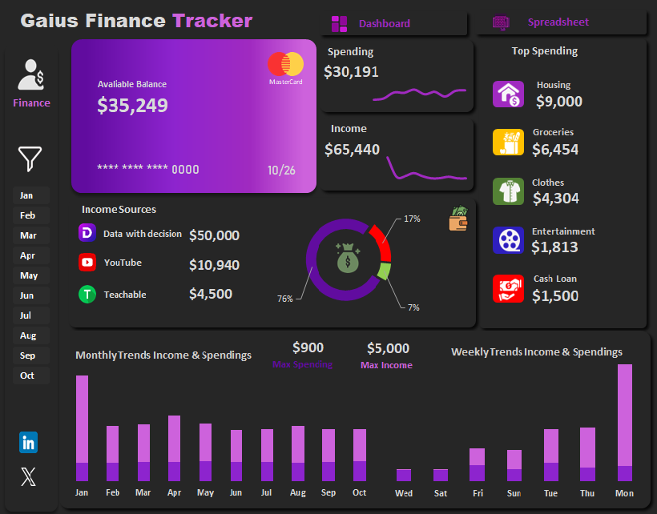

# 📊 Gaius Personal Finance Dashboard – Excel Analytics Project

## 📷 Dashboard Preview

Welcome to my **Personal Finance Dashboard Project**, an Excel-based data analysis and visualization built to track, analyze, and interpret personal financial activities over time. This project reflects my growing capabilities as a data analyst—combining technical skills with real-world financial insights.

This dashboard was created using **Microsoft Excel**, with guidance and inspiration from a tutorial series by **Freedom Oboh**, hosted on **Evergreen Digital Tech Solution**. I was also assisted by my friend **Felix Asota**, who generously shared the resources he used to create his own version.

---

## 🎯 Project Objective

The core objectives of this project were to:
- Track and manage personal income and spending
- Categorize transactions for clear understanding of spending habits
- Discover patterns in cash flow based on **time**, **category**, and **source**
- Design a **professional-level Excel dashboard** for personal finance
- Extract actionable insights to improve financial decisions
- Build a strong **portfolio-ready project** to showcase data analysis skills

---

## 📁 Dataset Structure

The dataset consists of transaction records structured across these columns:
- **Date**
- **Description**
- **Debit (Expense)**
- **Credit (Income)**
- **Main Category**
- **Sub-category**
- **Income/Expense Tag**
- **Derived columns**:
  - `Month`
  - `Weekday`
  - `Net Amount`

This structure allowed me to slice and dice the data using pivot tables and formulas to derive meaningful patterns.

---

## 📊 Key Financial Summary

| Metric                    | Value      |
|---------------------------|------------|
| 💰 Total Income            | $65,440    |
| 💸 Total Spending          | $30,191    |
| 💳 Available Balance       | $35,249    |
| 🔺 Max Monthly Income      | $14,000 (Jan) |
| 🔻 Max Monthly Spending     | $3,116.10 (May) |

---

## 🔍 In-Depth Insights

### 1. **Income Source Analysis**

| Source             | Amount     | Percentage |
|--------------------|------------|------------|
| Data With Decision | $50,000    | 76%        |
| YouTube            | $10,940    | 17%        |
| Teachable          | $4,500     | 7%         |

📌 **Insight**:  
My income is heavily concentrated (76%) from a single primary source—**Data With Decision**. While this shows a successful stream, it also exposes risk. The contributions from YouTube and Teachable are promising, indicating a **diversification trend** through content creation and knowledge monetization. These smaller streams can be nurtured to provide more stability over time.

---

### 2. **Top Spending Categories**

| Category      | Amount     | Insight |
|---------------|------------|---------|
| Housing       | $9,000     | Largest fixed cost, likely rent/mortgage |
| Groceries     | $6,454     | Significant but essential; can be optimized |
| Clothes       | $4,304     | High discretionary spending |
| Entertainment | $1,813     | Relatively moderate lifestyle spend |
| Cash Loan     | $1,500     | Debt repayment – needs monitoring |

📌 **Insight**:  
Essential costs such as **Housing and Groceries** dominate, as expected. However, Clothes spending stands out as a discretionary area that can be re-evaluated. Loan repayment implies some level of existing debt—an opportunity to minimize interest and improve savings.

---

### 3. **Monthly Financial Patterns**

#### Income Peaks

| Month  | Income     |
|--------|------------|
| January | $14,000   |
| April   | $7,340    |
| March   | $6,000    |

📌 **Insight**:  
January’s spike indicates potential **contract pay**, **bonuses**, or project completion. If this is a yearly trend, it's strategic to **budget and save** from January’s income for leaner months like October or November.

#### Spending Peaks

| Month  | Spending    |
|--------|-------------|
| May     | $3,116.10   |
| October | $3,098.70   |
| September | $3,087.10 |

📌 **Insight**:  
Spending is relatively stable across the year, but **peaks coincide with mid-year and Q4**—a common pattern due to events, lifestyle purchases, and possible travel. Budget controls or awareness campaigns should target these months.

---

### 4. **Weekly Income and Expense Trends**

| Day       | Net Flow     |
|-----------|--------------|
| Monday    | $26,697.00   |
| Thursday  | $8,181.80    |
| Tuesday   | $4,705.90    |
| Sunday    | $2,320.40    |
| Saturday  | -$3,241.00   |
| Wednesday | -$3,464.30   |

📌 **Insight**:  
Most income is credited on **Mondays and Thursdays**, suggesting a structured payday cycle. However, **weekend spending (Saturday) and mid-week drops (Wednesday)** show impulse spending and bill payments. Financial discipline or transaction delays can help shift the outflows to align better with inflows.

---

## ✅ Strategic Recommendations

1. ### 🔁 **Diversify Income Further**
   Relying on one income source can be risky. Expand and invest more time into Teachable and YouTube. Create new digital products or courses to increase passive income streams.

2. ### 📉 **Implement Spending Controls**
   Use the dashboard monthly to monitor discretionary spending (especially clothes, entertainment). Set hard limits using Excel budget templates or automation tools.

3. ### 📆 **Budget With the Calendar**
   Allocate a portion of January’s high income toward an annual emergency fund. Plan for Q2 and Q4 spending surges by starting small savings buffers in Q1.

4. ### 📊 **Track Debt Progress**
   Create a debt reduction tracker. Ensure cash loans or liabilities are not growing faster than savings. A snowball or avalanche method could be applied to repayment strategies.

5. ### 📈 **Monthly Dashboard Review**
   Hold a “financial review” at the end of each month using this dashboard. This encourages accountability and reflection on financial goals.

6. ### 💬 **Add Financial Notes Column**
   Future iterations could include a "Notes" field per transaction for personal context—what was bought, why, and if it was worth it. This helps spot emotional or impulse spending.

7. ### ⏳ **Introduce Forecasting**
   Use Excel's `FORECAST.LINEAR` or `TREND` functions to predict income and expenses for coming months based on historical data.

---

## 🧾 Conclusion

This finance tracker project started as a tutorial but evolved into a **real-world, data-driven personal finance assistant**. Beyond technical growth in Excel, this project helped me understand:

- How to clean, format, and enrich transaction data
- The power of visualization for decision-making
- The importance of tracking every dollar
- How to find actionable stories in data

### 🚀 My Growth Highlights:
- Learned advanced Excel techniques like pivot charts, data modeling, calculated fields, and slicers
- Practiced data storytelling through design
- Produced a portfolio-worthy dashboard that’s both **useful** and **visually professional**

This project marks a milestone in my data analysis journey and is the kind of work I hope to do more of in personal finance, small business analytics, and freelance dashboards.

---

## 💻 Tools and Skills Used

- **Excel Features:** Pivot Tables, Pivot Charts, Slicers, Data Validation, Named Ranges
- **Formulas:** `SUMIFS`, `IF`, `TEXT`, `MONTH`, `WEEKDAY`, `VLOOKUP`, `IFERROR`
- **Design Elements:** Color themes, iconography, layout balance
- **Soft Skills:** Financial discipline, storytelling, presentation
- **Icons:** Flaticons

---

## 🎥 Tutorials That Guided This Project

- [📹 Part 1: Create a Personal Finance Tracker with Excel](https://youtu.be/vlrTMK6zbw0)
- [📹 Part 2: Continue the Project Here](https://youtu.be/ouxHuLS2HCQ)

Huge thanks to:
- **Freedom Oboh** (Instructor & Dashboard Designer)
- **Evergreen Digital Tech Solution** (Platform)
- **Felix Asibor** (Friend & Colleague)

---

## 🔗 Connect With Me

Feel free to reach out if you’d like to collaborate, ask questions, or share your own version of the dashboard:

- 🌐 [LinkedIn](https://www.linkedin.com/in/gaius-ufondu-859123233/)
- 📁 [GitHub Portfolio](https://github.com/gaiusufondu)
- 💬 DM me on any platform to discuss data or dashboards!

---

**#ExcelDashboard #DataAnalytics #FinanceTracking #PortfolioProject #FreedomOboh #EvergreenDigitalTech #FelixAsota #LearningByDoing #FinancialLiteracy #DashboardDesign #DataStorytelling**
